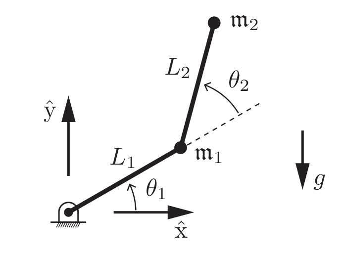
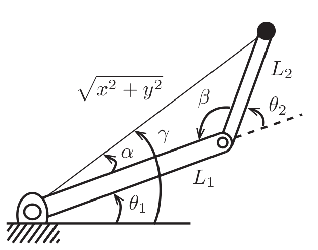

# Tarea 6.1

* Modele un robot de 2 gdl articular en el plano vertical, trazando una lemniscata asimétrica de Bernoulli
* Realiza un simulador considerando los parámetros físicos del robot
* Implemente un control PD
* Presente 6 métricas de evaluación de desempeño, interprete cada métrica e indice de desempeño
* Proponga un indice de desempeño compuesto por al menos 2 métricas

## Modelo del robot

Para este ejercicio se considero una representación sencilla de un robot planar de dos articulaciones rotacionales (ver figura 1). El robot consiste de dos articulaciones con longitudes $L_1, L_2$ y con masas $\mathfrak{m}_1, \mathfrak{m}_2$ respectivamente. 

Para la realización del simulador es necesario modelar las ecuaciones de movimiento del robot, en este caso el problema que se busca resolver es la dinámica directa del robot:
$$
\ddot{\theta} = M^{-1}(\theta)(\tau - h(\theta, \dot{\theta})),
$$
donde $\theta \in \mathbb{R}^n$ es el vector que representa la configuración articular con $n=2$, $\tau \in \mathbb{R}^n$ es el vector de fuerzas y pares, $M(\theta) \in \mathbb{R}^{n \times n}$ es la matriz simétrica positiva-definida conocida como matriz de masa [MR ref] y $h(\theta, \dot{\theta}) = c(\theta, \dot{\theta}) + h(\theta)$ es el termino que contiene al vector de Coriolis y al de gravedad. 

La resolución del modelo se realizo utilizando la formulación de Euler-Lagrange, en donde cada elemento del vector de fuerzas/pares esta expresado como
$$
\begin{aligned}
\tau_i &= \frac{d}{dt} \frac{\partial \mathcal{L}}{\partial \dot{\theta}_i} - \frac{\partial \mathcal{L}}{\partial \theta_i}, &&
i = 1, 2
\end{aligned}
$$
Al agrupar la solución de cada termino podemos obtener la siguiente expresión
$$
\tau=M(\theta) \ddot{\theta}+\underbrace{c(\theta, \dot{\theta})+g(\theta)}_{h(\theta, \dot{\theta})},
$$
con
$$
\begin{aligned}
M(\theta) &=\left[\begin{array}{cc}
\mathfrak{m}_{1} L_{1}^{2}+\mathfrak{m}_{2}\left(L_{1}^{2}+2 L_{1} L_{2} \cos \theta_{2}+L_{2}^{2}\right) & \mathfrak{m}_{2}\left(L_{1} L_{2} \cos \theta_{2}+L_{2}^{2}\right) \\
\mathrm{~m}_{2}\left(L_{1} L_{2} \cos \theta_{2}+L_{2}^{2}\right) & \mathfrak{m}_{2} L_{2}^{2}
\end{array}\right] \\ \\

c(\theta, \dot{\theta}) &=\left[\begin{array}{c}
-\mathfrak{m}_{2} L_{1} L_{2} \sin \theta_{2}\left(2 \dot{\theta}_{1} \dot{\theta}_{2}+\dot{\theta}_{2}^{2}\right) \\
\mathfrak{m}_{2} L_{1} L_{2} \dot{\theta}_{1}^{2} \sin \theta_{2}
\end{array}\right] \\ \\

g(\theta) &=\left[\begin{array}{c}
\left(\mathfrak{m}_{1}+\mathfrak{m}_{2}\right) L_{1} g \cos \theta_{1}+\mathfrak{m}_{2} g L_{2} \cos \left(\theta_{1}+\theta_{2}\right) \\
\mathfrak{m}_{2} g L_{2} \cos \left(\theta_{1}+\theta_{2}\right)
\end{array}\right]
\end{aligned}
$$

## Trayectoria de la tarea

La tarea que tiene que resolver nuestro controlador es la de seguir una Lemniscata de Bernoulli asimétrica, cada punto de la Lemniscata sobre el espacio de la tarea esta definido por la siguiente ecuación paramétrica:
$$
\begin{aligned}
x(u) &= w \frac{\cos(u)}{1 + \sin^{2}(u)} \\ \\
y(u) &= h \frac{\sin(u) \cos(u)}{1 + \sin^{2}(u)} 
\end{aligned}
$$
los coeficientes $w, h$ definen el largo y alto de la curva respectivamente. Para lograr la propiedad de asimetría se evalúa la posición sobre el eje horizontal, tal que:
$$
x = \left\{ \begin{array}{ll} x(u) & \text{si } x(u) \geq 0 \\ a\;x(u) & \text{si } x(u) < 0 \end{array}\right.
$$
finalmente es necesario expresar la trayectoria en el espacio de configuración $\theta_d(t)$ para calcular el error $\theta_e(t) = \theta_d(t) - \theta(t)$, para esto es necesario calcular la cinemática inversa del robot. Que para este caso sencillo, se puede encontrar analíticamente por medio de propiedades geométricas del robot.

En la figura 2 se aprecian los diferentes ángulos que se forman en el modelo del robot planar. Los ángulos $\alpha$ y $\beta$ los podemos encontrar por ley de cosenos como:
$$
\begin{align}
\beta &= \cos ^{-1}\left(\frac{L_{1}^{2}+L_{2}^{2}-x^{2}-y^{2}}{2 L_{1} L_{2}}\right) \\ \\
\alpha &= \cos ^{-1}\left(\frac{x^{2}+y^{2}+L_{1}^{2}-L_{2}^{2}}{2 L_{1} \sqrt{x^{2}+y^{2}}}\right)
\end{align}
$$
Finalmente podemos encontrar dos soluciones a la cinemática inversa como
$$
\theta = \begin{bmatrix} \text{atan2}(y, x) - \alpha \\ \pi - \beta\end{bmatrix},
$$
para configuración de codo arriba o
$$
\theta = \begin{bmatrix} \text{atan2}(y, x) + \alpha \\ \beta - \pi\end{bmatrix},
$$
para configuración de codo abajo.